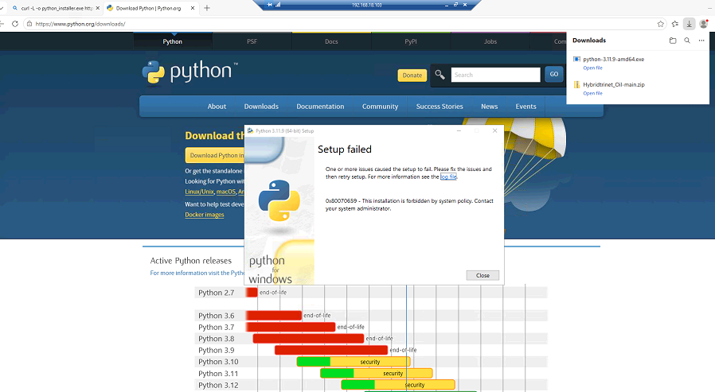
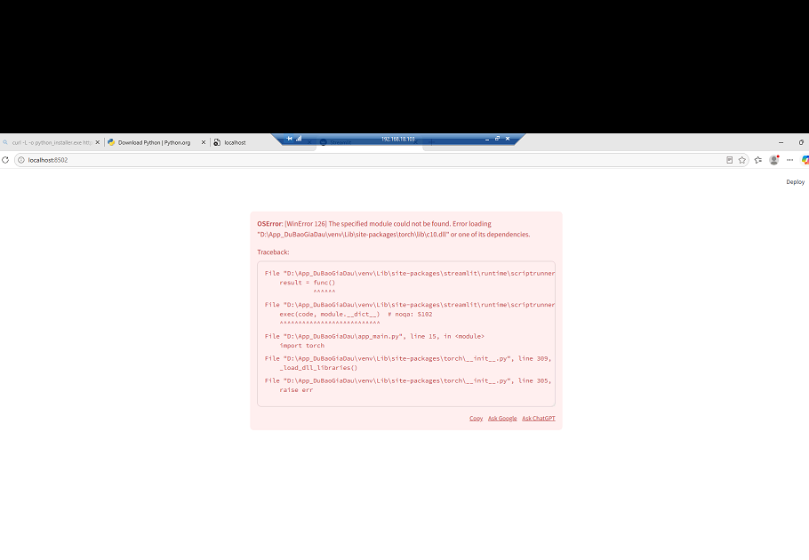
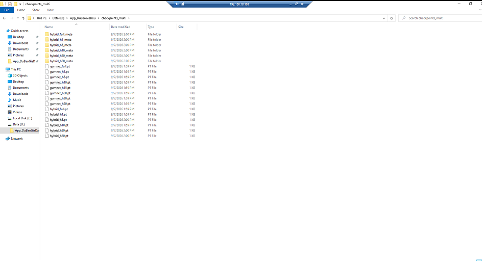
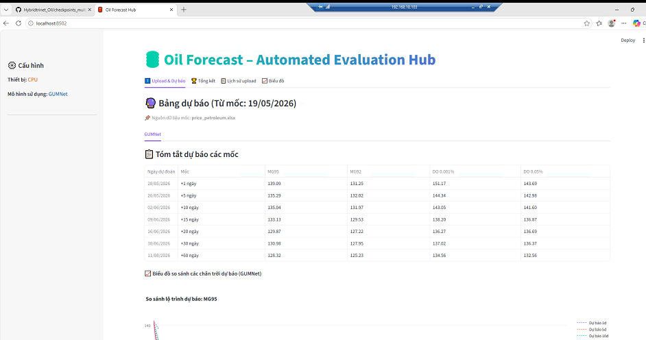

# TÀI LIỆU HƯỚNG DẪN TRIỂN KHAI & SỬ DỤNG HỆ THỐNG DỰ BÁO GIÁ DẦU
**Hệ thống:** Oil Forecast – Automated Evaluation Hub (Kiến trúc mô hình GUMNet)  
**Môi trường áp dụng:** Hệ điều hành Windows Server (Hạ tầng mạng nội bộ / Local LAN)  
**Đối tượng sử dụng:** Bộ phận Quản trị CNTT (IT Admin) & Cán bộ nghiệp vụ phân tích kinh doanh  
**Phiên bản tài liệu:** 2.0 (Cập nhật chuẩn hóa triển khai)

---

## MỤC LỤC
1. [Giới thiệu hệ thống & Khuyến nghị phần cứng](#1-giới-thiệu-hệ-thống--khuyến-nghị-phần-cứng)
2. [Quy trình triển khai 1: Tự động hóa qua giao diện dòng lệnh (Khuyến nghị)](#2-quy-trình-triển-khai-1-tự-động-hóa-qua-giao-diện-dòng-lệnh-khuyến-nghị)
3. [Quy trình triển khai 2: Cài đặt từng bước bằng giao diện đồ họa (Dự phòng)](#3-quy-trình-triển-khai-2-cài-đặt-từng-bước-bằng-giao-diện-đồ-họa-dự-phòng)
4. [Hướng dẫn xử lý các tình huống kỹ thuật thường gặp](#4-hướng-dẫn-xử-lý-các-tình-huống-kỹ-thuật-thường-gặp)
5. [Sổ tay hướng dẫn sử dụng chi tiết cho người dùng nghiệp vụ](#5-sổ-tay-hướng-dẫn-sử-dụng-chi-tiết-cho-người-dùng-nghiệp-vụ)
6. [Thiết lập ứng dụng tự động khởi động cùng hệ thống máy chủ](#6-thiết-lập-ứng-dụng-tự-động-khởi-động-cùng-hệ-thống-máy-chủ)

---

## 1. GIỚI THIỆU HỆ THỐNG & KHUYẾN NGHỊ PHẦN CỨNG

### 1.1. Mục tiêu ứng dụng
Hệ thống **Oil Forecast Hub** cung cấp giải pháp chuyển đổi số hỗ trợ dự báo xu hướng giá các mặt hàng xăng dầu chủ lực theo nhiều chân trời thời gian: **+1 ngày, +5 ngày, +10 ngày, +15 ngày, +20 ngày, +30 ngày và +60 ngày**.

Bốn mặt hàng xăng dầu theo dõi gồm:
- **MG95** (Xăng Mogas 95)
- **MG92** (Xăng Mogas 92)
- **DO 0.001%** (Dầu Diesel 10ppm)
- **DO 0.05%** (Dầu Diesel 500ppm)

### 1.2. Đặc tả môi trường máy chủ
Hệ thống đã được thử nghiệm và nghiệm thu thực tế trên cấu hình:
- **Hệ điều hành:** Microsoft Windows Server 2022 Datacenter (64-bit).
- **Bộ vi xử lý (CPU):** 6 vCPUs (Kiến trúc Intel Broadwell).
- **Bộ nhớ trong (RAM):** 16.0 GB (Dung lượng khả dụng thông thường: ~13.4 GB).
- **Không gian lưu trữ:** Triển khai trên ổ đĩa dữ liệu chuyên dụng `Data (D:)` (Dung lượng trống >200 GB).
- **Phần cứng đồ họa:** Không trang bị card GPU rời (CPU-only).
- **Địa chỉ mạng nội bộ:** `http://192.168.18.103:8502`.

### 1.3. Khuyến nghị về phạm vi vận hành của máy chủ
- **Nhiệm vụ khai thác và dự báo hàng ngày (Inference):** Kiến trúc mạng nơ-ron GUMNet được tối ưu hóa cho chuỗi thời gian dạng bảng (dung lượng mỗi tệp trọng số từ 280 KB đến 2.9 MB). Tốc độ CPU tính toán dự báo cho toàn bộ 7 mốc thời gian diễn ra nhanh chóng (dưới 1 giây), bộ nhớ RAM sử dụng dưới 450 MB. Do đó, phần cứng hiện tại hoàn toàn đáp ứng trơn tru và bền bỉ cho mục đích vận hành hàng ngày.
- **Lưu ý về tác vụ huấn luyện chuyên sâu (Training/Finetuning):** Quá trình huấn luyện lại mô hình từ đầu đòi hỏi năng lực tính toán song song lớn từ card đồ họa chuyên dụng (NVIDIA CUDA). Để đảm bảo tính ổn định và tuổi thọ cho máy chủ nghiệp vụ, khuyến nghị mọi hoạt động huấn luyện mô hình được thực hiện trên máy trạm AI chuyên dụng, sau đó chuyển giao các tệp trọng số đã hoàn thiện vào máy chủ này.

---

## 2. QUY TRÌNH TRIỂN KHAI 1: TỰ ĐỘNG HÓA QUA GIAO DIỆN DÒNG LỆNH (KHUYẾN NGHỊ)

Phương pháp này được khuyến nghị áp dụng cho cán bộ quản trị CNTT khi bàn giao máy chủ mới, thực hiện hoàn toàn qua cửa sổ **Command Prompt (CMD)** với quyền quản trị viên mà không cần thao tác tải thủ công từ trình duyệt web.

### Bước 2.1: Tải và thiết lập công cụ Git tự động
Mở Command Prompt bằng quyền **Run as administrator** và thực thi các câu lệnh sau:

```cmd
powershell -Command "[Net.ServicePointManager]::SecurityProtocol = [Net.SecurityProtocolType]::Tls12; (New-Object System.Net.WebClient).DownloadFile('https://github.com/git-for-windows/git/releases/download/v2.47.1.windows.1/Git-2.47.1-64-bit.exe', '%temp%\git_setup.exe')"
"%temp%\git_setup.exe" /VERYSILENT /NORESTART
del "%temp%\git_setup.exe"
```
*Ghi chú: Quá trình thiết lập diễn ra tự động trong khoảng 15-20 giây. Sau khi hoàn tất, đóng cửa sổ CMD hiện tại và mở cửa sổ CMD mới để hệ thống cập nhật biến môi trường `git`.*

### Bước 2.2: Đồng bộ toàn bộ mã nguồn và trọng số mô hình
Tại cửa sổ CMD mới, tạo thư mục chứa ứng dụng trên ổ `D:` và tiến hành đồng bộ:

```cmd
mkdir D:\App_DuBaoGiaDau
cd /d D:\App_DuBaoGiaDau
git clone https://github.com/kennhope13/Hybridtrinet_Oil.git .
```
*(Lưu ý: Có dấu chấm ` .` ở cuối dòng lệnh để đặt mã nguồn trực tiếp vào thư mục gốc).*

**Ưu điểm kỹ thuật:** Lệnh `git clone` tự động kích hoạt cơ chế **Git LFS**, tải trọn vẹn 100% các tệp trọng số mô hình AI nhị phân (~18 MB) vào thư mục `checkpoints_multi`, đảm bảo không phát sinh hiện tượng tệp tin bị thiếu dữ liệu.

### Bước 2.3: Khởi tạo môi trường và Chạy ứng dụng
Vẫn tại thư mục `D:\App_DuBaoGiaDau`, chạy tệp tin:

```cmd
CHAY_UNG_DUNG.bat
```

Tệp xử lý sẽ tự động thực hiện các tác vụ:
1. Tải và cài đặt tự động môi trường Python 3.11.9.
2. Thiết lập môi trường ảo cách ly (`venv`).
3. Cài đặt các thư viện cần thiết (`PyTorch CPU`, `Streamlit`, `Pandas`, `Openpyxl`...).
4. Khởi động dịch vụ máy chủ web tại địa chỉ `http://localhost:8502`.

---

## 3. QUY TRÌNH TRIỂN KHAI 2: CÀI ĐẶT TỪNG BƯỚC BẰNG GIAO DIỆN ĐỒ HỌA (DỰ PHÒNG)

Áp dụng trong trường hợp môi trường mạng của đơn vị có chính sách giới hạn lệnh tải từ terminal.

### Bước 3.1: Cài đặt Python 3.11.9
1. Sử dụng trình duyệt Chrome trên máy chủ, tải tệp cài đặt chính thức:  
   `https://www.python.org/ftp/python/3.11.9/python-3.11.9-amd64.exe`  
   *(Khuyến nghị sử dụng phiên bản 3.11 để đảm bảo độ tương thích tốt nhất với thư viện PyTorch).*
2. Chuột phải vào tệp vừa tải về trong thư mục `Downloads` $
ightarrow$ chọn **Run as administrator**.
3. **Lưu ý quan trọng:** Đánh dấu tích vào ô lựa chọn: **`☑ Add python.exe to PATH`** ở phía dưới màn hình cài đặt.
4. Nhấn **Install Now** $
ightarrow$ chờ hoàn tất $
ightarrow$ nhấn **Close**.

### Bước 3.2: Cài đặt gói hỗ trợ Microsoft Visual C++ Redistributable (x64)
1. Tải gói bổ trợ từ Microsoft:  
   `https://aka.ms/vs/17/release/vc_redist.x64.exe`
2. Mở tệp `vc_redist.x64.exe` $
ightarrow$ Chọn đồng ý điều khoản $
ightarrow$ Nhấn **Install** $
ightarrow$ chọn **Close**.

### Bước 3.3: Tải mã nguồn và Đồng bộ tệp mô hình
1. Tải gói mã nguồn nén qua đường dẫn:  
   `https://github.com/kennhope13/Hybridtrinet_Oil/archive/refs/heads/main.zip`
2. Giải nén toàn bộ nội dung tệp vào thư mục `D:\App_DuBaoGiaDau`.
3. **Lưu ý kỹ thuật về tệp mô hình:** Các tệp tải về từ nút "Download ZIP" trên giao diện web GitHub chỉ chứa con trỏ tham chiếu Git LFS (~1 KB). Quản trị viên cần sao chép tệp trọng số đầy đủ (từ 285 KB đến 2.9 MB mỗi tệp) đặt vào thư mục `D:\App_DuBaoGiaDau\checkpoints_multi`.

### Bước 3.4: Khởi chạy
Nhấp đúp chuột vào tệp `CHAY_UNG_DUNG.bat` trong thư mục `D:\App_DuBaoGiaDau`.

---

## 4. HƯỚNG DẪN XỬ LÝ CÁC TÌNH HUỐNG KỸ THUẬT THƯỜNG GẶP

Dưới đây là tổng hợp các tình huống ghi nhận trong quá trình cấu hình thực tế và giải pháp xử lý tương ứng:

### Tình huống 1: Thông báo chính sách `0x80070659 - Forbidden by system policy`
- **Hiện tượng:** Khi chạy bộ cài đặt Python xuất hiện thông báo lỗi chính sách bảo mật hệ thống.
- **Nguyên nhân:** Windows Server áp dụng chính sách hạn chế tài khoản người dùng thông thường thực thi các tệp đóng gói cài đặt.
- **Giải pháp:** Thực thi tệp cài đặt bằng cách nhấp chuột phải và chọn **Run as administrator**.


*Hình 1: Thông báo chính sách bảo mật và Giao diện cài đặt hoàn tất khi chạy bằng quyền quản trị viên.*

---

### Tình huống 2: Lỗi thiếu thư viện liên kết `c10.dll` khi khởi động PyTorch
- **Hiện tượng:** Giao diện ứng dụng hiển thị lỗi `OSError: [WinError 126] The specified module could not be found... c10.dll`.
- **Nguyên nhân:** Hệ điều hành máy chủ mới chưa được trang bị gói thư viện Visual C++ Runtime của Microsoft.
- **Giải pháp:** Cài đặt gói `vc_redist.x64.exe` (khoảng 14 MB). Sau khi cài đặt hoàn tất, làm mới lại trang web (nhấn **F5**) để ứng dụng nạp lại mô hình.


*Hình 2: Thông báo yêu cầu bổ sung gói thư viện liên kết C++ runtime.*

---

### Tình huống 3: Cảnh báo `Chưa có model GUMNet h1`
- **Hiện tượng:** Trang web hoạt động bình thường nhưng tại các tab mốc thời gian xuất hiện dòng thông báo chưa có mô hình.
- **Nguyên nhân:** Tệp mô hình hiện tại chỉ là tệp con trỏ văn bản của Git LFS (dung lượng 1 KB) do quá trình tải file ZIP thủ công từ trình duyệt.
- **Giải pháp:**
  - *Phương án chuẩn:* Sử dụng lệnh `git clone` để công cụ tự động đồng bộ đầy đủ các tệp dữ liệu nhị phân.
  - *Phương án bổ sung:* Sao chép thư mục trọng số đầy đủ vào `D:\App_DuBaoGiaDau\checkpoints_multi`, sau đó trên giao diện web chọn biểu tượng menu (3 chấm dọc) ở góc phải $
ightarrow$ chọn **Clear cache** $
ightarrow$ nhấn **Rerun**.


*Hình 3: Tệp mô hình con trỏ tham chiếu 1 KB (cần thay thế bằng tệp trọng số hoàn chỉnh từ 285 KB - 2.9 MB).*

---

### Tình huống 4: Cửa sổ dòng lệnh tạm dừng hiển thị (`Select Command Prompt`)
- **Hiện tượng:** Tiến trình tải hoặc chạy trong CMD dừng lại, tiêu đề cửa sổ xuất hiện tiền tố `Select Command Prompt`.
- **Nguyên nhân:** Chế độ chọn văn bản nhanh (QuickEdit) của Windows console được kích hoạt khi có thao tác nhấp chuột vào vùng màu đen.
- **Giải pháp:** Nhấp chuột vào cửa sổ CMD và nhấn phím **Enter** (hoặc **Esc**) để bỏ trạng thái lựa chọn và tiếp tục tiến trình.

---

### Tình huống 5: Máy trạm trong mạng nội bộ chưa kết nối được ứng dụng
- **Hiện tượng:** Máy chủ mở ứng dụng bình thường tại `localhost:8502`, nhưng máy trạm khác truy cập `http://192.168.18.103:8502` không phản hồi.
- **Nguyên nhân:** Tường lửa của máy chủ (Windows Defender Firewall) chưa cấu hình cho phép cổng `8502` nhận kết nối Inbound từ mạng nội bộ.
- **Giải pháp:** Mở CMD với quyền quản trị viên trên máy chủ và thực hiện lệnh mở cổng:
  ```cmd
  netsh advfirewall firewall add rule name="Oil Forecast Web" dir=in action=allow protocol=TCP localport=8502
  ```

---

## 5. SỔ TAY HƯỚNG DẪN SỬ DỤNG CHI TIẾT CHO NGƯỜI DÙNG NGHIỆP VỤ


*Hình 4: Giao diện trực quan của Hệ thống Dự Báo Giá Dầu tại http://localhost:8502.*

Hệ thống được thiết kế với giao diện thân thiện, vận hành qua trình duyệt web và chia thành các khu vực chức năng rõ ràng:

### 5.1. Khu vực 1: Bảng kết quả dự báo tổng hợp (Mặc định)
- **Cơ chế tự động:** Ngay khi mở trang web, hệ thống tự động nhận diện mốc dữ liệu gần nhất đã có trong cơ sở dữ liệu để tính toán ngay bảng giá dự báo tương lai cho 4 mặt hàng (`MG95`, `MG92`, `DO 0.001%`, `DO 0.05%`).
- **Các mốc thời gian hiển thị:**
  - **Dự báo ngắn hạn (+1 ngày, +5 ngày):** Phù hợp cho công tác điều hành giá và theo dõi biến động từng phiên giao dịch.
  - **Dự báo trung hạn (+10 ngày, +15 ngày, +20 ngày):** Phục vụ cho kế hoạch nhập hàng và cân đối tồn kho chu kỳ nửa tháng đến một tháng.
  - **Dự báo dài hạn (+30 ngày, +60 ngày):** Hỗ trợ hoạch định chiến lược kinh doanh và đánh giá xu thế vĩ mô.
- **Biểu đồ lộ trình:** Phía dưới bảng số liệu là đồ thị biểu diễn quỹ đạo biến thiên của từng mặt hàng, giúp người dùng nắm bắt trực quan xu hướng tăng hoặc giảm trong tương lai.

### 5.2. Khu vực 2: Quy trình cập nhật dữ liệu mới (Upload dữ liệu)
Khi có số liệu thị trường mới (hàng ngày hoặc định kỳ hàng tuần), cán bộ nghiệp vụ thực hiện các bước:
1. Chuẩn bị tệp dữ liệu dạng Excel (`.xlsx`, `.xls`) hoặc tệp văn bản phân tách bằng dấu phẩy (`.csv`).
   - *Yêu cầu cấu trúc:* Tệp cần có cột ngày tháng (ví dụ: `Ngày`, `Date`) và các cột giá tương ứng của các mặt hàng.
2. Cuộn xuống mục **`[1] Upload file mới`** trên trang web.
3. Nhấp vào nút **`Browse files`** (hoặc kéo thả tệp trực tiếp vào khung nét đứt).
4. **Phản hồi của hệ thống:**
   - Hệ thống tự động phân tích cấu trúc tệp, trích xuất chuỗi lịch sử đến ngày mới nhất vừa tải lên.
   - Mô hình AI trên CPU tiến hành tính toán suy luận (thời gian xử lý thông thường từ 1 đến 2 giây).
   - Bảng dự báo mới xuất hiện ngay phía dưới với tiêu đề thông báo mốc dữ liệu vừa được tính toán.

### 5.3. Các Tab nâng cao hỗ trợ phân tích và kiểm chứng (Backtesting)
Phía trên cùng giao diện gồm 4 tab điều hướng chuyên sâu:
- **Tab 1 – Upload & Dự báo:** Màn hình tác nghiệp chính sử dụng hàng ngày để xem kết quả và tải dữ liệu mới.
- **Tab 2 – Tổng kết:** Cung cấp báo cáo phân tích độ tin cậy của mô hình dựa trên dữ liệu lịch sử đã qua kiểm chứng:
  - *Chỉ số MAPE (% sai số trung bình tuyệt đối):* Thể hiện sai số theo từng mốc thời gian và từng sản phẩm xăng dầu (màu xanh lá cây biểu thị độ chuẩn xác cao, sai số thấp).
  - *Hệ thống thông báo độ tin cậy:* Tự động hiển thị huy hiệu xanh khi sai số ở mức an toàn (<7%), giúp người dùng an tâm khi ra quyết định kinh doanh.
- **Tab 3 – Lịch sử upload:** Lưu trữ nhật ký các đợt cập nhật dữ liệu trước đây. Người dùng có thể chọn từng đợt để xem lại bảng so sánh chi tiết giữa mức giá mà AI đã dự báo trước đó với giá thực tế thị trường đã diễn ra.
- **Tab 4 – Biểu đồ:** Khu vực phân tích đồ họa chuyên sâu, cho phép so sánh đường giá thực tế (đường nét liền xanh ngọc) với đường dự báo của mô hình (đường nét đứt), hỗ trợ đánh giá khả năng bắt nhịp chu kỳ thị trường của AI.

---

## 6. THIẾT LẬP ỨNG DỤNG TỰ ĐỘNG KHỞI ĐỘNG CÙNG HỆ THỐNG MÁY CHỦ

Để dịch vụ web luôn duy trì liên tục và tự động kích hoạt lại mỗi khi máy chủ khởi động lại sau các đợt bảo trì định kỳ, bộ phận CNTT có thể cấu hình thông qua công cụ **Windows Task Scheduler**:

1. Nhấn tổ hợp phím `Windows + R`, nhập `taskschd.msc` và nhấn **Enter**.
2. Tại khung điều khiển bên phải, chọn mục **Create Basic Task...**:
   - **Name:** Đặt tên tác vụ, ví dụ: `OilForecastHub_AutoStart`.
   - **Trigger:** Chọn `When the computer starts` (Khởi động cùng máy tính).
   - **Action:** Chọn `Start a program`.
   - **Program/script:** Nhập đường dẫn tệp thực thi: `D:\App_DuBaoGiaDau\CHAY_UNG_DUNG.bat`.
   - **Start in (optional):** Nhập đường dẫn thư mục làm việc: `D:\App_DuBaoGiaDau\`.
3. Nhấn **Finish** để hoàn tất việc tạo tác vụ.
4. Nhấp đúp vào tác vụ vừa tạo trong danh sách, tại thẻ **General**:
   - Chọn mục **`Run whether user is logged on or not`** (Chạy độc lập không cần người dùng đăng nhập màn hình).
   - Đánh dấu tích vào ô **`Run with highest privileges`** (Chạy với quyền hạn hệ thống cao nhất).
   - Nhấn **OK** để lưu cấu hình.

---
*Tài liệu kỹ thuật được chuẩn hóa và ban hành phục vụ công tác bàn giao hệ thống, ngày 07/09/2026.*
