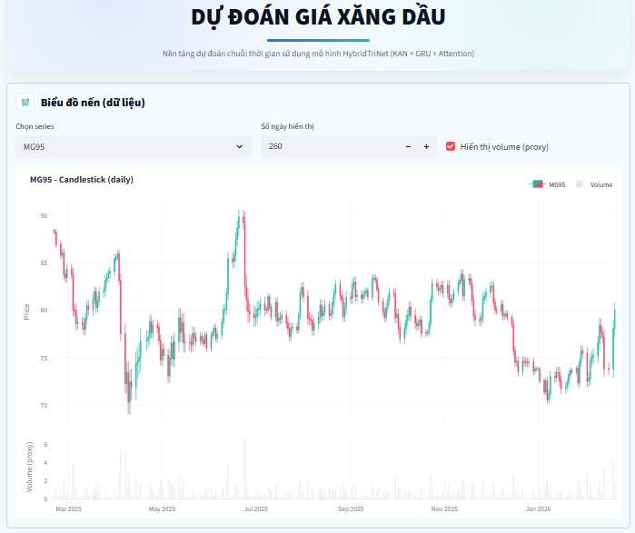
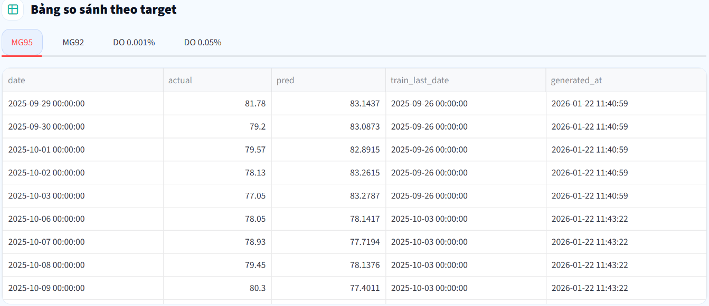
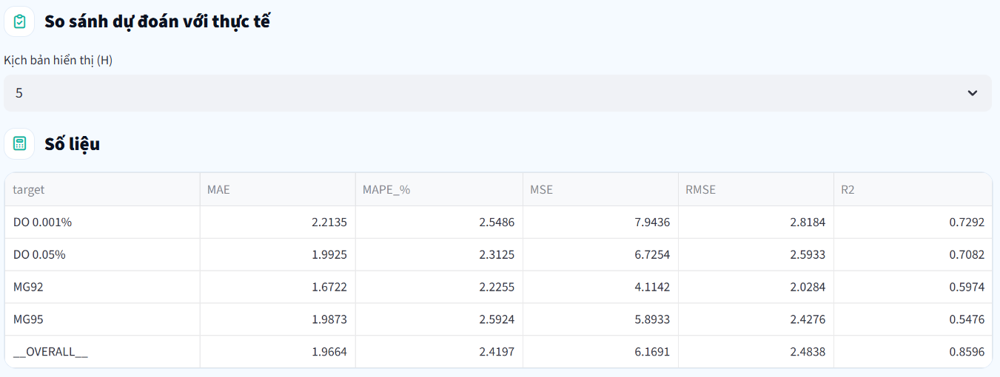
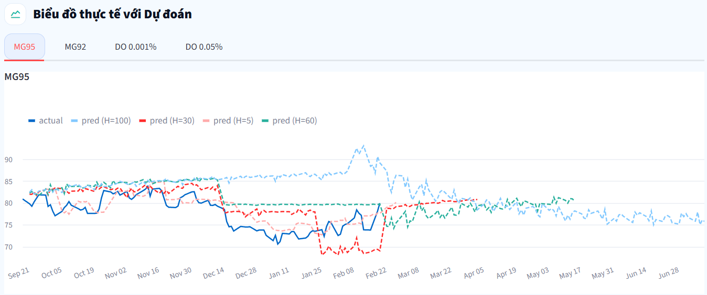
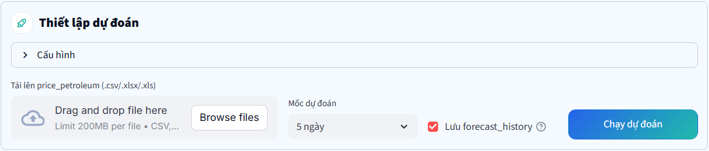

# HybridTriNet Oil Forecast

Ứng dụng **Streamlit** dự báo giá xăng dầu theo chuỗi thời gian bằng mô hình **HybridTriNet (KAN + GRU + Attention)**.  
Hỗ trợ **đọc dữ liệu gốc**, **upload file price_petroleum để gộp/cập nhật**, xử lý NaN / nội suy một số biến ngoại sinh và **dự báo N ngày làm việc tiếp theo**, kèm biểu đồ so sánh **Dự báo vs Thực tế** và bảng **metrics**.

---

## Demo giao diện

### 1) Biểu đồ nền (dữ liệu)
Hiển thị chuỗi dữ liệu theo dạng candlestick (daily), kèm volume proxy.


### 2) Biểu đồ Thực tế vs Dự đoán (nhiều kịch bản H)
So sánh actual với các đường dự báo theo nhiều horizon (ví dụ H=5/30/60/100).


### 3) Metrics tổng hợp (MAE / MAPE / MSE / RMSE / R2)
Bảng đánh giá theo từng target và tổng hợp overall.


### 4) Bảng so sánh theo target (actual/pred theo ngày)
Bảng dữ liệu chi tiết phục vụ đối chiếu.


### 5) Upload & Thiết lập dự đoán
Upload file dữ liệu mới, chọn horizon và chạy dự đoán; có thể lưu forecast_history.


---

## Tính năng chính

- Dự báo chuỗi thời gian giá xăng dầu theo nhiều target (MG95, MG92, DO 0.001%, DO 0.05%).
- Hỗ trợ **upload** file `price_petroleum` để gộp/cập nhật dữ liệu.
- Xử lý dữ liệu: parse ngày, xử lý thiếu (NaN), nội suy một số biến ngoại sinh.
- Dự báo **N ngày làm việc tiếp theo** (business days).
- Theo dõi và lưu lịch sử dự báo (`forecast_history`) để so sánh theo nhiều kịch bản H.
- Dashboard trực quan:
  - Candlestick dữ liệu nền
  - Actual vs Forecast
  - Metrics (MAE, MAPE, MSE, RMSE, R²)
  - Bảng đối chiếu chi tiết theo ngày

---

## Yêu cầu dữ liệu

### File upload `price_petroleum`
- Định dạng: `.csv`, `.xlsx`, `.xls`
- Bắt buộc có cột ngày đúng tên với ô **“Cột ngày”** trong app (mặc định: `Ngày`)
- Khuyến nghị: dữ liệu theo ngày (daily)

---

## Cài đặt

### Python
Khuyến nghị **Python 3.10+**.

### Cài thư viện
Nếu repo đã có `requirements.txt`:
```bash
pip install -r requirements.txt