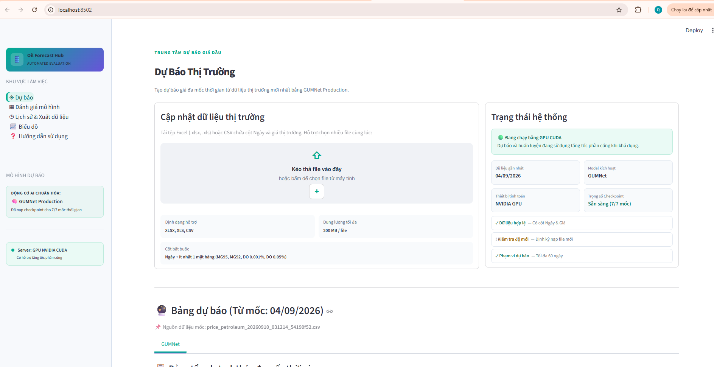
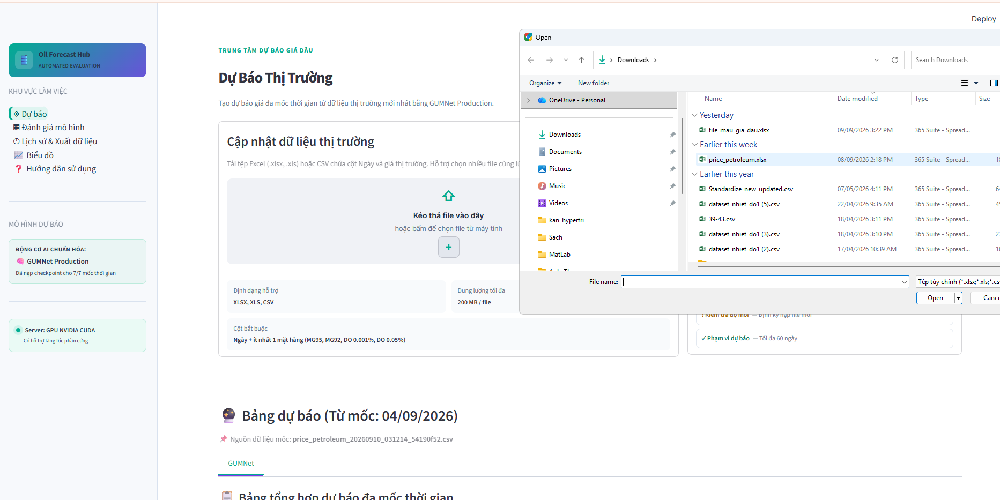
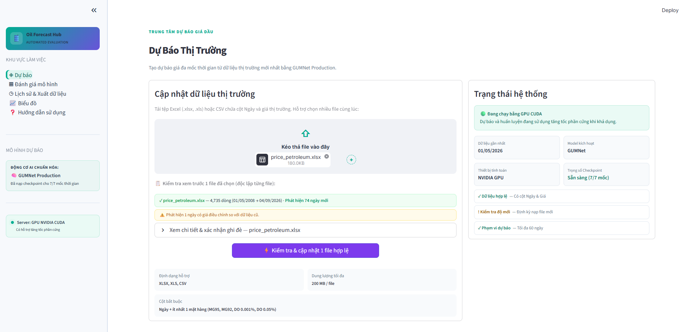
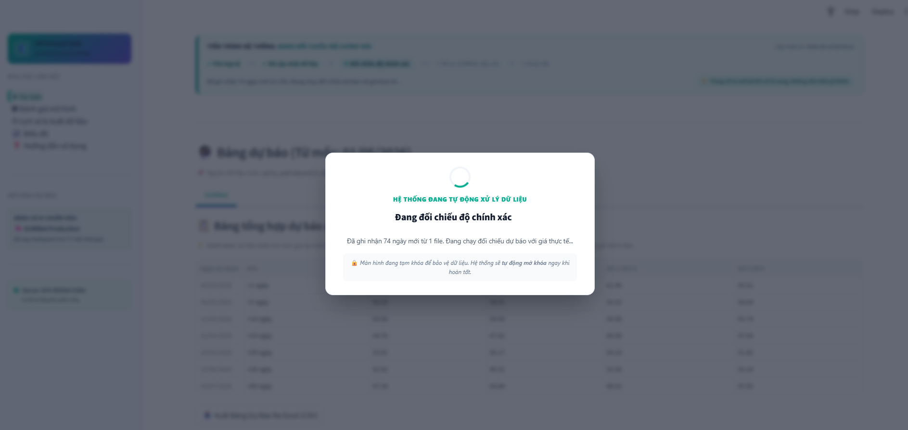
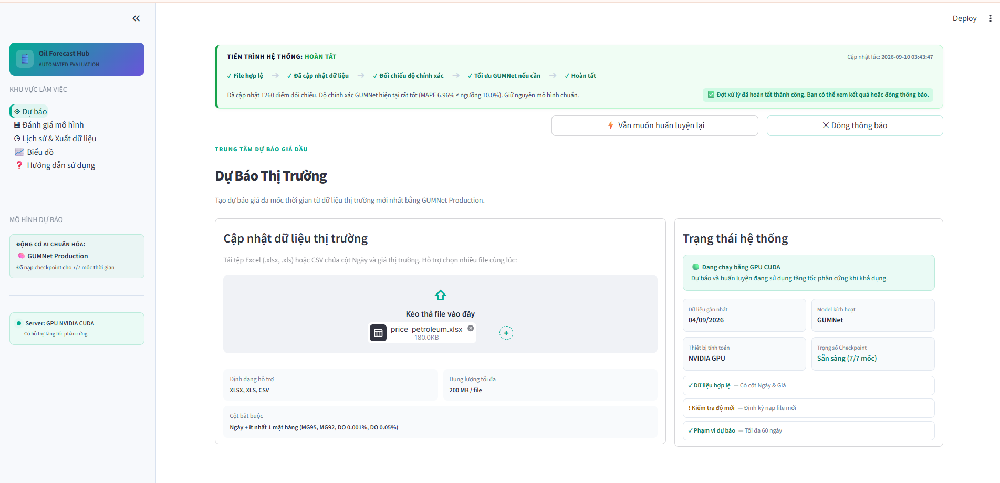
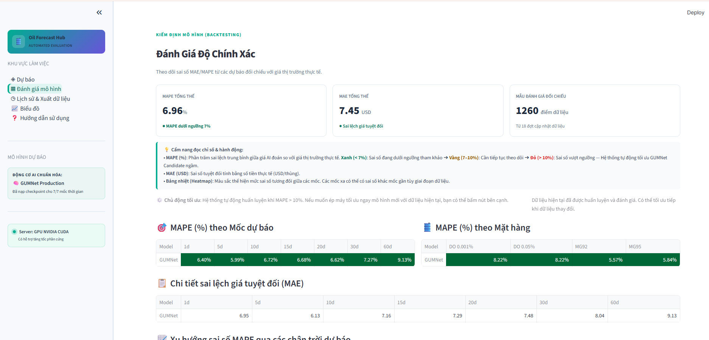
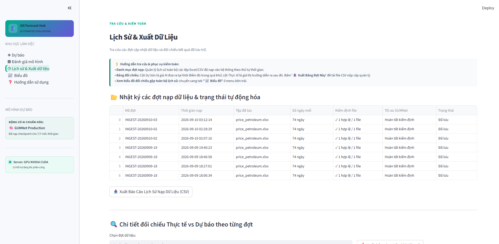
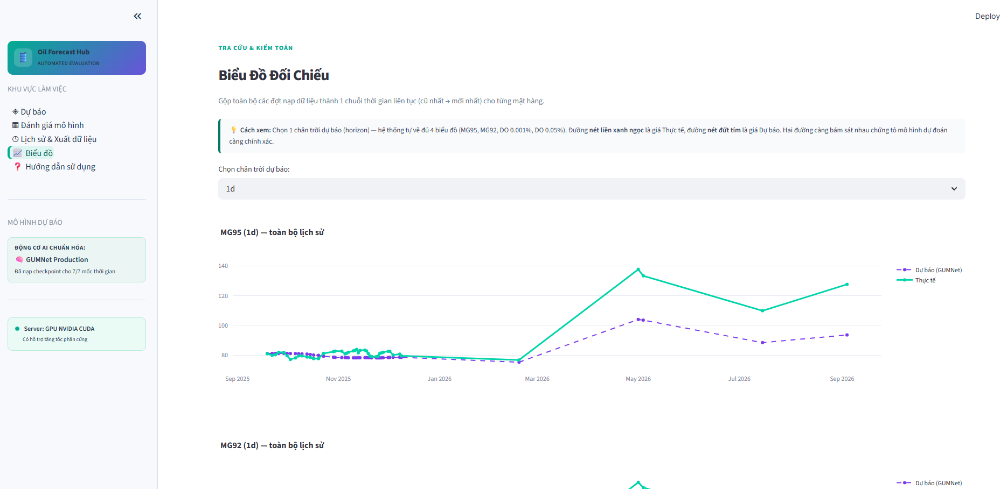
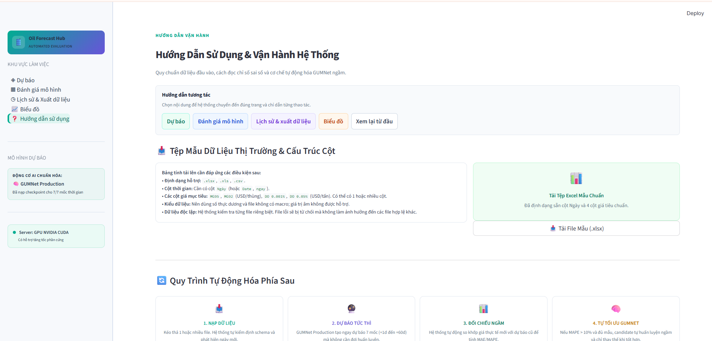

# Hướng dẫn sử dụng Oil Forecast Hub

## 1. Mục đích

Oil Forecast Hub tiếp nhận dữ liệu giá dầu, tạo dự báo nhiều mốc thời gian bằng GUMNet, đối chiếu dự báo với giá thực tế và lưu lại lịch sử để tra cứu.

Tài liệu này mô tả quy trình thao tác trên giao diện hiện tại. Các chỉ số trong ảnh là số liệu của một lần chạy mẫu; khi dùng dữ liệu khác, kết quả có thể thay đổi.

## 2. Các khu vực chính

Thanh bên gồm 5 khu vực:

- **Dự báo**: tải dữ liệu mới, kiểm tra và cập nhật dữ liệu.
- **Đánh giá mô hình**: xem MAPE, MAE và các bảng phân tích sai số.
- **Lịch sử & Xuất dữ liệu**: xem các đợt nạp dữ liệu và xuất báo cáo.
- **Biểu đồ**: so sánh giá thực tế với giá dự báo theo từng mốc.
- **Hướng dẫn sử dụng**: mở các hướng dẫn tương tác trong ứng dụng.

## 3. Chuẩn bị file dữ liệu

File có thể dùng là `.xlsx`, `.xls` hoặc `.csv`, dung lượng tối đa hiển thị trên giao diện là **200 MB/file**.

File cần có:

- Một cột ngày, thường đặt tên là `Ngày`, `Date` hoặc `ngay`.
- Ít nhất một cột giá thuộc các mặt hàng: `MG95`, `MG92`, `DO 0.001%`, `DO 0.05%`.
- Ngày và giá nên được chuẩn hóa, không để tiêu đề cột bị trống.

Có thể tải file mẫu từ phần **Hướng dẫn sử dụng**. Khi chọn file, hộp thoại của hệ điều hành sẽ hiện ra để chọn file trong thư mục Downloads hoặc thư mục khác.

## 4. Tải file và kiểm tra trước

1. Mở tab **Dự báo**.
2. Kéo file vào vùng tải lên hoặc bấm nút `+`.
3. Chờ hệ thống kiểm tra độc lập từng file.
4. Đọc phần xem trước: số dòng, khoảng ngày, số ngày mới và cảnh báo giá bị điều chỉnh.
5. Chỉ bấm cập nhật khi file hợp lệ và đúng dữ liệu cần nạp.

Ví dụ trên giao diện cho thấy file có 4.735 dòng, có dữ liệu từ 01/05/2008 đến 04/09/2026, phát hiện 74 ngày mới và 1 ngày có giá được điều chỉnh. Đây là thông tin kiểm tra của ảnh mẫu, không phải giá trị cố định cho mọi file.

## 5. Kiểm tra và cập nhật dữ liệu

Sau khi file hợp lệ, bấm **Kiểm tra & cập nhật**. Hệ thống sẽ:

1. Ghi nhận file và cập nhật dữ liệu.
2. Tạo dự báo bằng các checkpoint GUMNet hiện có.
3. Đối chiếu các dự báo đã đến hạn với giá thực tế.
4. Tính các chỉ số sai số.
5. Chỉ đề xuất hoặc thực hiện tối ưu khi điều kiện tự động được đáp ứng.

File lỗi được báo riêng và không nên làm mất các file hợp lệ khác trong cùng lần chọn.

## 6. Trong lúc hệ thống xử lý

Trong khi đối chiếu, giao diện hiển thị hộp thoại **Đang đối chiếu độ chính xác**. Màn hình tạm khóa để tránh người dùng bấm lặp hoặc thay đổi dữ liệu khi pipeline đang chạy.

Hãy chờ trạng thái chuyển sang **Hoàn tất** hoặc **Có sự cố**. Không nên đóng terminal, khởi động lại server hoặc bấm cập nhật lần nữa trong thời gian này.

## 7. Đọc thông báo hoàn tất

Khi xong, banner tiến trình hiển thị các bước đã hoàn thành và kết quả đối chiếu. Ví dụ trong ảnh:

- Đã cập nhật 1.260 điểm đối chiếu.
- MAPE là 6,96%, đang dưới ngưỡng tự động tối ưu 10%.
- Hệ thống giữ nguyên mô hình chuẩn.

Nếu hệ thống quyết định không tối ưu, điều đó có nghĩa là mô hình hiện tại vẫn được giữ lại theo điều kiện an toàn. Không nên hiểu là lần cập nhật không có dữ liệu mới.

## 8. Đánh giá độ chính xác

Mở **Đánh giá mô hình** để xem kết quả tổng hợp.

- **MAPE tổng thể (%)**: phần trăm sai lệch trung bình giữa dự báo và giá thực tế.
- **MAE tổng thể (USD)**: sai lệch tuyệt đối trung bình theo đơn vị giá.
- **Mẫu đánh giá đối chiếu**: số điểm dữ liệu thực sự có đủ dự báo và giá thực tế để tính.
- **MAPE theo Mốc dự báo**: so sánh sai số giữa 1, 5, 10, 15, 20, 30 và 60 ngày.
- **MAPE theo Mặt hàng**: so sánh sai số giữa MG95, MG92 và các loại DO.
- **Chi tiết sai lệch giá tuyệt đối (MAE)**: xem MAE riêng theo từng mốc.

Nút **Tối ưu mô hình ngay** dùng cho trường hợp cần chủ động yêu cầu huấn luyện candidate. Chỉ số trước và sau huấn luyện phải được đối chiếu trên cùng phạm vi dữ liệu; candidate chỉ nên được dùng khi vượt qua kiểm định và cải thiện theo tiêu chí của hệ thống.

## 9. Lịch sử và xuất dữ liệu

Mở **Lịch sử & Xuất dữ liệu** để xem từng đợt nạp:

- Mã đợt và thời gian nạp.
- Tên file đã lưu.
- Số ngày mới.
- Kết quả kiểm định file.
- Trạng thái tối ưu GUMNet.
- Trạng thái lưu đợt.

Chọn một đợt bên dưới để xem chi tiết các dòng thực tế, dự báo và sai lệch. Dùng nút xuất tương ứng để tải báo cáo CSV của lịch sử hoặc của đợt đang chọn.

## 10. Biểu đồ đối chiếu

Mở **Biểu đồ**, chọn một chân trời dự báo như `1d`, `5d` hoặc `60d`. Hệ thống hiển thị các biểu đồ theo từng mặt hàng.

- Đường màu xanh ngọc: giá thực tế.
- Đường nét đứt màu tím: giá GUMNet dự báo.
- Hai đường càng gần nhau thì dự báo ở mốc đó càng sát dữ liệu thực tế.

Biểu đồ dùng để quan sát xu hướng và các đoạn sai lệch lớn; muốn biết con số chính xác, xem thêm bảng MAPE và MAE.

## 11. Hướng dẫn tương tác trong ứng dụng

Trong tab **Hướng dẫn sử dụng**, chọn nội dung tương ứng:

- **Dự báo**: hướng dẫn chọn file, kiểm tra và cập nhật.
- **Đánh giá mô hình**: hướng dẫn đọc MAPE, MAE và nút tối ưu.
- **Lịch sử & xuất dữ liệu**: hướng dẫn chọn đợt, xem chi tiết và xuất file.
- **Biểu đồ**: hướng dẫn chọn mốc và đọc hai đường dữ liệu.
- **Xem lại từ đầu**: chạy lại toàn bộ chuỗi hướng dẫn.

Khi tour tương tác mở, nền trang sẽ mờ và thành phần cần thao tác được làm nổi bật bằng khung sáng cùng mũi tên. Bấm **Tiếp theo** để đi qua từng bước, **Bỏ qua** để đóng tour hoặc **Hoàn tất** ở bước cuối.

## 12. Quy trình nhanh hằng ngày

1. Chuẩn bị file có cột ngày và ít nhất một cột giá hợp lệ.
2. Vào **Dự báo**, chọn file và đọc kết quả kiểm tra.
3. Bấm cập nhật một lần.
4. Chờ thông báo hoàn tất.
5. Vào **Đánh giá mô hình** để xem MAPE/MAE mới.
6. Vào **Lịch sử & Xuất dữ liệu** nếu cần kiểm toán hoặc tải báo cáo.
7. Vào **Biểu đồ** nếu cần xem trực quan từng chân trời.

## 13. Khi có cảnh báo hoặc lỗi

- Nếu file không hợp lệ: kiểm tra tên cột, định dạng ngày và giá trị rỗng rồi tải lại.
- Nếu đang xử lý: không bấm lặp; chờ trạng thái kết thúc.
- Nếu có thông báo tối ưu không thành công: mô hình production hiện tại vẫn được giữ an toàn; xem lịch sử và log trước khi thử lại.
- Nếu trang vẫn khóa sau khi tiến trình đã kết thúc: cần kiểm tra trạng thái pipeline và làm mới ứng dụng theo hướng dẫn vận hành của hệ thống.

## 14. Ghi chú trước khi chuyển sang PDF

Các ảnh trong tài liệu là ảnh chụp giao diện dùng để minh họa thao tác. Trước khi phát hành PDF, nên xác nhận lại:

- Tên nút và tên tab có còn đúng với phiên bản đang triển khai.
- Các ngưỡng MAPE và mô tả cơ chế tối ưu có đúng với cấu hình production.
- Các con số trong ảnh có cần giữ nguyên như ví dụ hay thay bằng ảnh chụp dữ liệu chính thức.
- Tất cả ảnh hiển thị rõ ở khổ giấy PDF đã chọn.
